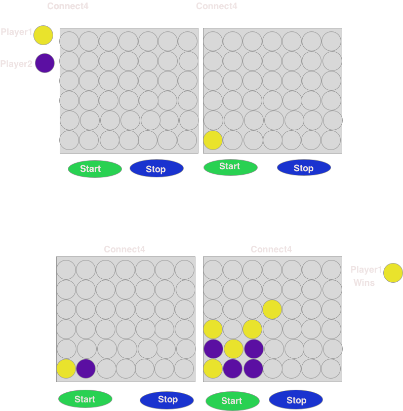

# Connect4
## Wireframe

## Game Instructions:

 1. The game is played on a grid that's 7 rows by 6 columns of total 42 holes.
 
 2. Sort and choose checker colors. Connect Four comes with 21 red checkers and 21 black checkers. 
 If Player 1 chooses red checkers then, computer chooses black checkers.Then,decide which player starts.

3. Player and the computer alternate turn after playing a checker.

4. Players drop one of their checkers down any of the slots in the top of the grid.

Players alternates until one player gets 4 checkers of his color in a row.

## Schedule(Objectives/Goals)
###Wednesday
1. Wireframes
2. pseudo code

###Thursday

- HTML coding

###Friday

- JS coding

###Saturday

- HTML, JS 

###Sunday

- HTML, JS

###Monday

- testing

### References:
- https://www.ultraboardgames.com/connect4/game-rules.php